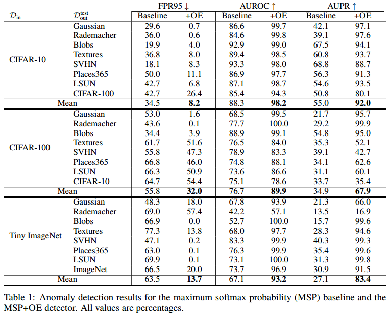

# Outlier Exposure

This repository contains the essential code for the paper _Deep Anomaly Detection with Outlier Exposure_ (see paper.pdf).

Requires Python 3+ and PyTorch 0.3+.

## Overview

Outlier Exposure (OE) is a method for improving anomaly detection performance in deep learning classifiers. Using a large out-of-distribution database, we fine-tune a classifier so that anomalies are scored differently from in-distribution samples. This repository includes a subset of the calibration and multiclass classification experiments. Please consult the paper for the full results and method descriptions.
 

## Citation

If you find this useful in your research, please consider citing:

    @article{hendrycks2018oe,
      title={Deep Anomaly Detection with Outlier Exposure},
      author={Hendrycks, Dan and Mazeika, Mantas and Dietterich, Thomas},
      journal={arXiv preprint},
      year={2018}
    }

## Outlier Datasets

These experiments make use of numerous outlier datasets. Links for less common datasets are as follows, [Icons-50](https://github.com/hendrycks/robustness),
[Textures](https://www.robots.ox.ac.uk/~vgg/data/dtd/), [Chars74K](http://www.ee.surrey.ac.uk/CVSSP/demos/chars74k/EnglishImg.tgz), and [Places365](http://places2.csail.mit.edu/download.html).

