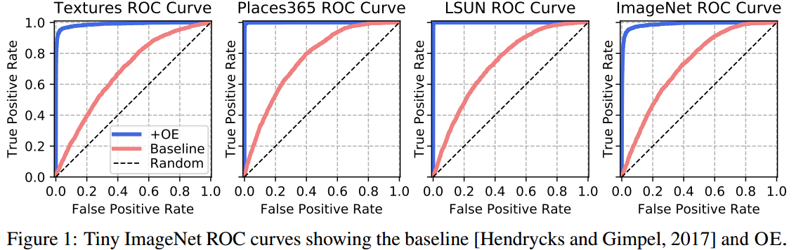

# Outlier Exposure

This repository contains the essential code for the paper [_Deep Anomaly Detection with Outlier Exposure_](https://arxiv.org/abs/1812.04606) (ICLR 2019).

Requires Python 3+ and PyTorch 0.4.1+.

## Overview

Outlier Exposure (OE) is a method for improving anomaly detection performance in deep learning models. Using an out-of-distribution dataset, we fine-tune a classifier so that the model learns heuristics to distinguish anomalies and in-distribution samples. Crucially, these heuristics generalize to new distributions. Unlike ODIN, OE does not require a model per OOD dataset and does not require tuning on "validation" examples from the OOD dataset in order to work. This repository contains a subset of the calibration and multiclass classification experiments. Please consult the paper for the full results and method descriptions.

Contained within this repository is code for the NLP experiments and the multiclass and calibration experiments for SVHN, CIFAR-10, CIFAR-100, and Tiny ImageNet.

## Outlier Dataset

[**80 Million Tiny Images is available here (mirror link).**](http://www.archive.org/download/80-million-tiny-images-2-of-2/tiny_images.bin)

If you do not want to use 80 Million Tiny Images, we prepared a cleaned ("debiased") subset with 300K images. We removed images that belong to CIFAR classes from it, images that belong to Places or LSUN classes, and images with divisive metadata.

[**300K Random Images is available here.**](https://people.eecs.berkeley.edu/~hendrycks/300K_random_images.npy)

## Citation

If you find this useful in your research, please consider citing:

    @article{hendrycks2019oe,
      title={Deep Anomaly Detection with Outlier Exposure},
      author={Hendrycks, Dan and Mazeika, Mantas and Dietterich, Thomas},
      journal={Proceedings of the International Conference on Learning Representations},
      year={2019}
    }

## Outlier Datasets

These experiments make use of numerous outlier datasets. Links for less common datasets are as follows, [80 Million Tiny Images (mirror link)](http://www.archive.org/download/80-million-tiny-images-2-of-2/tiny_images.bin), [Icons-50](https://github.com/hendrycks/robustness),
[Textures](https://www.robots.ox.ac.uk/~vgg/data/dtd/), [Chars74K](http://www.ee.surrey.ac.uk/CVSSP/demos/chars74k/EnglishImg.tgz), and [Places365](http://places2.csail.mit.edu/download.html).

